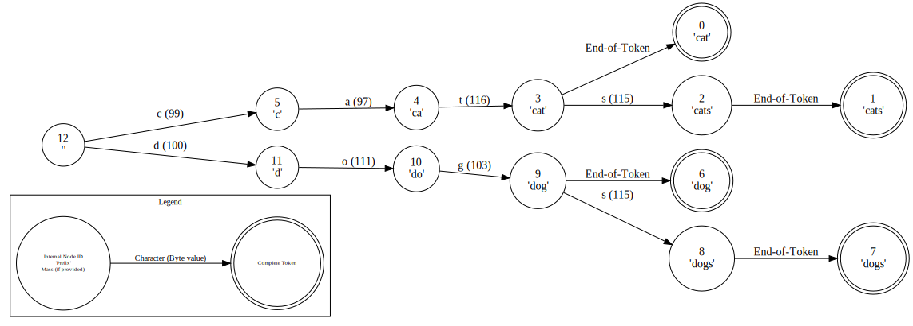

# GenLM Backend Documentation

GenLM Backend is a high-performance backend for language model probabilistic programs in the GenLM ecosystem. It provides essential tools and functions that serve as building blocks for more complex applications.

**Key Features**:

* **Asynchronous LLM Interfaces**: Asynchronous computation of next-token probabilities with `vllm` and `transformer` language models.
* **Tokenizer Vocabulary Decoding**: Decoding Hugging Face tokenizer vocabularies into their byte and string representations.
* **Token-Character Tries**: Efficient conversion from token distributions to byte-level distributions using a trie datastructure.

## Quick Start

### Installation

Clone the repository:
```bash
git clone https://github.com/probcomp/genlm-backend.git
cd genlm_backend
```
and install with pip:
```bash
pip install .
```
or install with development dependencies:
```bash
pip install -e ".[test,docs]"
```

## Main Components

### Asynchronous Language Model Backends

The [`genlm_backend.llm`](reference/genlm_backend/llm/__init__/) module provides asynchronous interfaces for computing next-token probabilities with `vllm` and `transformer` language models.

```python
from genlm_backend.llm import AsyncVirtualLM
# Initialize model with vLLM backend from a HuggingFace model name
llm = AsyncVirtualLM.from_name("gpt2")
```

These interfaces enable automatic batching of concurrent requests:

```python
import time
import asyncio

async def my_model(i):
    time.sleep(0.01) # Simulate CPU work.
    # Get log probabilities of next tokens given token_ids.
    return await llm.next_token_logprobs(token_ids=[i] * 10) 

# Both requests will be batched together by the underlying LM.
outs = asyncio.run(asyncio.gather(*[my_model(0), my_model(1)]))
```
as well as automatic output and KV caching, and CPU/GPU parallelization in certain scenarios.

This submodule includes three key classes:

- **AsyncVirtualLM** (GPU): vLLM-based backend optimized for next-token probability computations. Fastest and most memory-efficient; requires a GPU. Uses vLLM's prefix caching feature for KV caching.
- **AsyncTransformer** (CPU): HuggingFace-based backend for next-token probability computations. Slower and less memory-efficient; for CPU usage. Uses custom KV caching.
- **MockAsyncLM** (Testing): Mock implementation for development and testing.

See the [LLM Code Reference](reference/genlm_backend/llm/__init__/) for detailed API documentation.

### Token-Character Tries

The [`genlm_backend.trie`](reference/genlm_backend/trie/__init__/) module provides an efficient trie data structure for mapping probability distributions over tokens to distributions over bytes. This module enables applications which operate at the byte level rather than the token level. 

```python
from genlm_backend.trie import TokenCharacterTrie
# Initialize TokenCharacterTrie from a byte vocabulary
trie = TokenCharacterTrie(decode=[b'cat', b'cats', b'dog', b'dogs'])
trie.visualize()
```



Each node in the trie corresponds to a prefix of one or multiple tokens in the byte vocabulary. Internal nodes correspond to the incomplete prefixes and leaf nodes to complete tokens. The `mass_sum` function provides the marginal probability of each prefix (i.e., node) given a distribution on the underlying vocabulary:

```python
# Get mass at each node given a distribution over the vocab
mass = trie.mass_sum(p_llm=[0.4, 0.1, 0.3, 0.2])
trie.visualize(mass)
```


This submodule includes three key classes:

- **TokenCharacterTrie** (CPU): Base implementation for CPU usage.
- **ParallelTokenCharacterTrie** (GPU): GPU-accelerated version which uses sparse matrix operations for mass summing. Extends **TokenCharacterTrie** with a `batch_mass_sum` function.
- **AsyncTokenCharacterTrie** (Async): Asynchronous wrapper for use in asynchronous contexts; enables automatic batching of concurrent requests. This class can wrap either the sequential or parallel trie implementations.

See the [Trie Code Reference](reference/genlm_backend/trie/__init__/) for detailed API documentation.

### Vocabulary Decoding

The [`genlm_backend.tokenization`](reference/genlm_backend/tokenization/__init__/) module converts Hugging Face tokenizer vocabularies into byte and string representations, with each token's representation stored at its corresponding token ID in the output lists.

```python
from transformers import AutoTokenizer
from genlm_backend.tokenization import decode_vocab

# Load a tokenizer and decode its vocabulary
tokenizer = AutoTokenizer.from_pretrained("gpt2")
byte_vocab, str_vocab = decode_vocab(tokenizer)
byte_vocab[10] # Byte representation of token with ID 10
```

!!! warning
    The byte representation (`byte_vocab`) is the canonical form and should be preferred for reliable token handling. The string representation (`str_vocab`) is provided for convenience and debugging but may not correctly represent all tokens, especially those containing invalid UTF-8 sequences.

## Requirements

- Python >= 3.10
- The core dependencies listed in the `setup.py` file of the repository.

## Testing

When test dependencies are installed, the test suite can be run via:
```bash
pytest tests
```

## Performance Benchmarking

Performance benchmarks comparing different configurations can be found in our [benchmarks directory](https://github.com/probcomp/genlm-backend/tree/main/benchmark).
